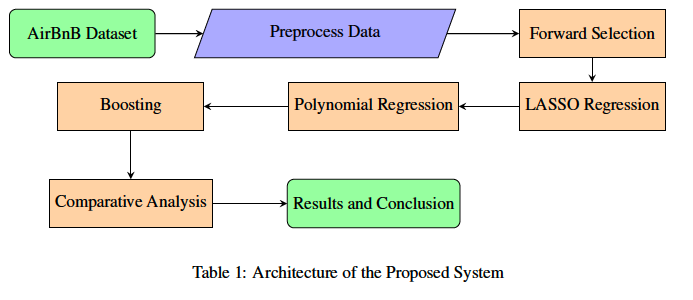
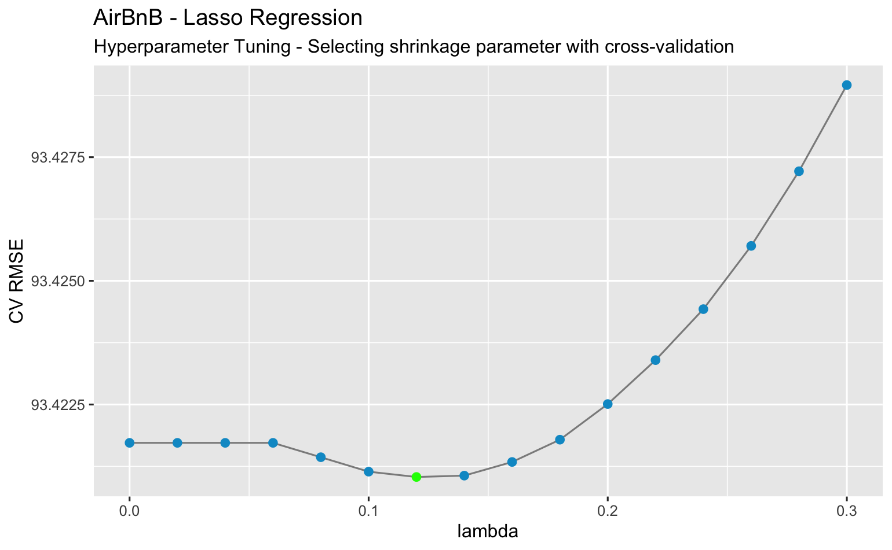
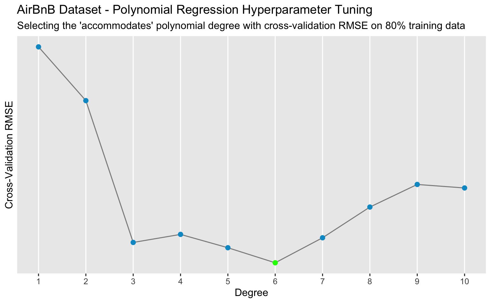
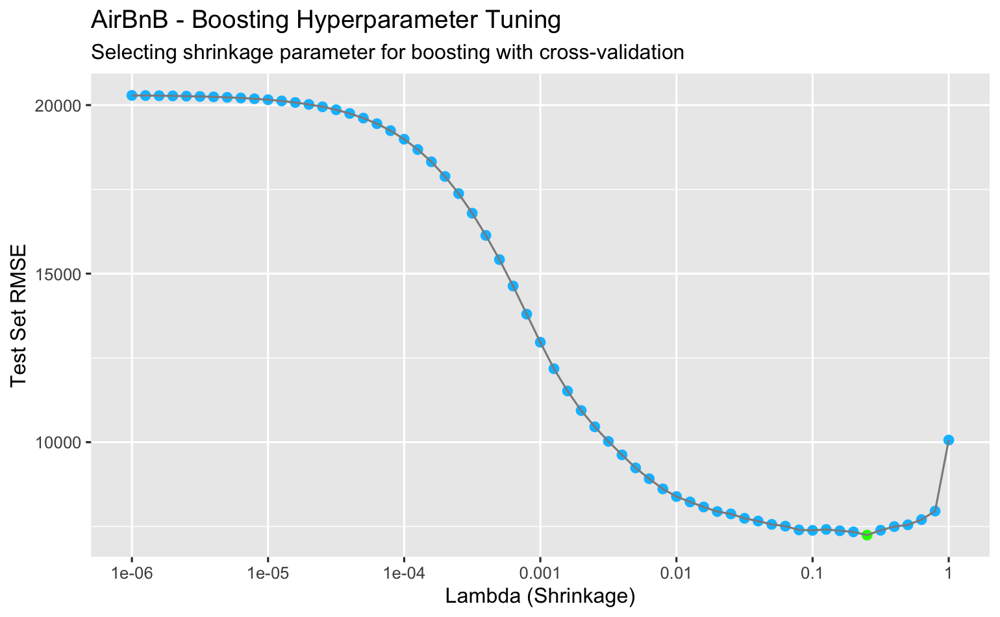

We present a brief overview of our research project in this write-up. A more detailed exploration can be found [here](https://github.com/nicwjh/AirBnB-Price-Prediction/blob/main/Final_Report.pdf).

## Project Overview

This econometrics project explores the utilization of supervised machine learning methods for price prediction of AirBnB rental listings. The motive of this study is to attempt to build a price prediction model that can prognosticate the price of an AirBnB listing with maximum accuracy. Additionally, we conduct statistical inference on feature significance through a process of robust feature selection.  

### Data
Experiments are run on the AirBnB listings in Major U.S. Cities Dataset sourced from the Kaggle repository [here](https://www.kaggle.com/datasets/rudymizrahi/airbnb-listings-in-major-us-cities-deloitte-ml). 

After a process of data cleaning and wrangling, we end up with a training dataset with 38,111 observations and test dataset with 9,558 observations with 22 features, one of which is a target label *price*. Tuning parameters are selected and models are trained using the 80% training data. The 20% training data is used as unseen held-out data for model evaluation.  

### Methods

As a high-level overview of our methodology, the data is first read and preprocessed. After data preprocessing, for models that need to be tuned, we conduct cross-validation on the training data to choose the tuning parameters for our methods. We then use a validation set approach to assess predictive performance on the held-out data for the following regression methods: forward selection, LASSO regression, polynomial regression, and boosting. Finally, results from our experiments are contrasted in a comparative analysis.  

### Training and hyperparameter tuning details 

In this section, we discuss our process of hyperparameter tuning for our LASSO regression, polynomial regression, and gradient boosting methods. 

For tuning our LASSO model, we proceeded with a process of K-fold cross-validation to tune the $\lambda$ hyperparameter. The $\lambda$ tuning parameter, controlling the regularization penalty, is particularly pertinent for LASSO because different values of $\lambda$ will result in different features being selected. This effectively makes LASSO a backwards greedy selection algorithm where the least useful features are the first to be eliminated by the regularization penalty. To accomplish this, we deploy repeated 5-fold cross-validation on the 80% training data (10 repeats). We optimize with the L1 penalty, select the remaining features with nonzero coefficients, train an unpenalized model with those features, and compare performance via RMSE. We repeat this process for 16 different values of λ (λ ∈ (0,0.3) with increments of 0.02) on each of the 5 folds and choose the λ that gives the best performance by RMSE. λ = 0.12 is chosen as the outcome of this process of cross-validation.

For our polynomial regression model, we opt for a single-variable polynomial regression of *accommodates* against *price* after a correlation analysis. Subsequently, we apply repeated 10-fold cross-validation on the 80% training data to choose the degree of our polynomial. With input feature accommodates as our predictor, a model is fit for each polynomial degree (ranging from 1-10) using each of the 10 folds as a test set once. This process is repeated 5 times and averaged using the caret package. The average cross-validation RMSE over this repeated 10-fold CV is calculated for each polynomial degree and the polynomial degree with the lowest cross-validation RMSE is then chosen as the degree of our polynomial. Degree = 6 is chosen as the outcome of this process of hyperparameter tuning.

Lastly, we will discuss our process of hyperparameter tuning for gradient boosting. We apply gradient boosting through the gbm function in the caret package. In the caret package, there are several tuning parameters for the gbm function: number of iterations (n.trees), complexity of the tree (interaction.depth), learning rate (shrinkage), and minimum number of training set samples in a node to commence splitting (n.minobsinnode). We set these tuning parameters to be: n.trees = 1000, interaction.depth = 2, and n.minobsinnode = 10. For the shrinkage tuning parameter, we test a sequence of 61 different λ values ∈ [10-6, 1] through a validation set approach to find the optimal shrinkage parameter that achieves the lowest cross-validated RMSE on our test set. λ = 0.2512 achieves the lowest test error and is chosen as a result of this process of cross-validation.

### Results 
  

